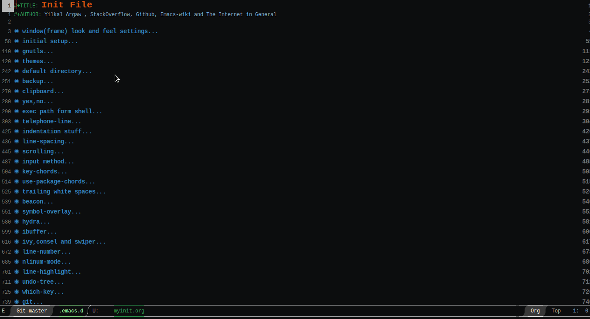
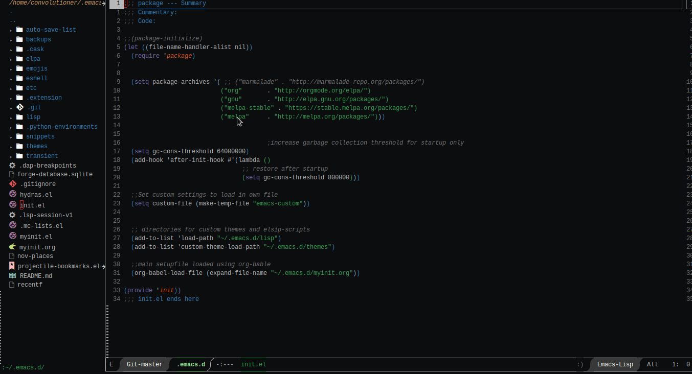
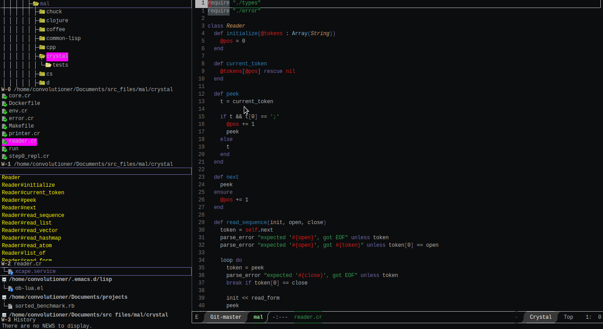
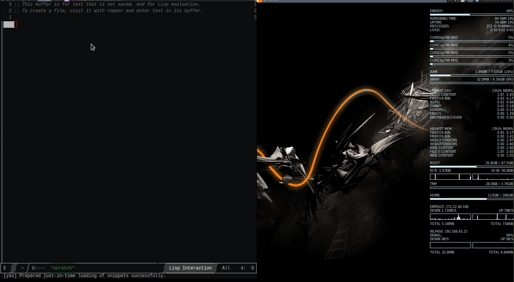

# yet-another-emacs

Is my personal emacs config and it is based on the earlier yet-another-emacs. I have tried to make it faster and saner than the old defaults.

# It Uses

  + ivy as a completion framework

  + telephone line with a customization for both emacsclient and emacs as a powerline

  + dired-sidebar for side tab file manager

  + hydra

  + projectile

  + the Hyper key for expanding the emacs key config and semicolon as a mod_shift key

  + etc ...

# Screenshots

